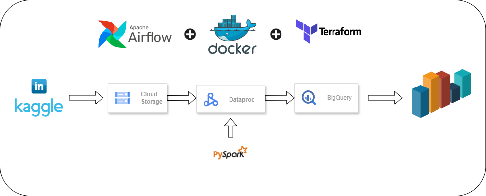
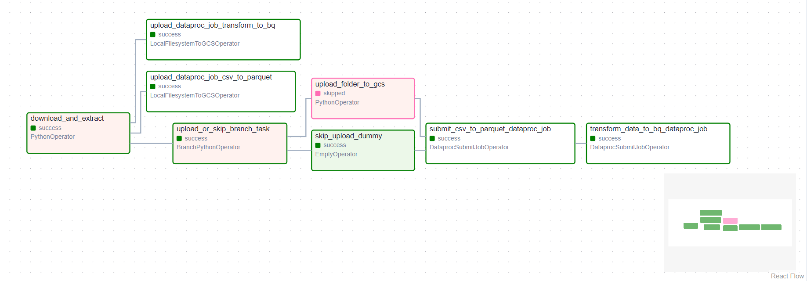
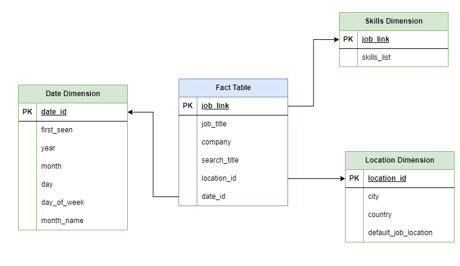

# Linkedin Data Pipeline

## Project Overview


The primary objective of this project was to replicate the functionality of the [SkillExplorer](https://skillexplorer.asaniczka.com/) website, with added custom features like country filters and organization-specific data views. The dataset, sourced from Kaggle [(link to the dataset)](https://www.kaggle.com/datasets/asaniczka/1-3m-linkedin-jobs-and-skills-2024), includes approximately 1.3 million job postings worldwide, totaling nearly 6 GB in uncompressed form.

This project emphasizes the data engineering components of the case study, covering data extraction, storage, and optimized modeling to ensure the data is query-ready and aligned with business requirements.

Throughout the entire process, automation and orchestration are achieved using **Apache Airflow**, with containerization provided by **Docker** and infrastructure management handled by **Terraform**.

## Technologies Used

- **Kaggle API**: Used to download the dataset directly from Kaggle.
- **Google Cloud Storage (GCS)**: Stores raw data before processing and transformation.
- **PySpark**: Handles large-scale data processing and transformation tasks.
- **Google Dataproc**: Managed Spark clusters to run the data processing jobs.
- **BigQuery**: Google Cloud’s fully-managed data warehouse, where the final processed data is stored.
- **Apache Airflow**: Orchestrates the entire data pipeline, automating tasks and scheduling workflows.
- **Docker**: Containerizes the project to ensure it runs consistently across different environments.
- **Terraform**: Automates the provisioning of cloud resources like Dataproc clusters, GCS storage, and BigQuery datasets.

## Airflow DAG


## Data Model
<p align="center">
  
</p>

## Results
**WIP**

## Steps to Recreate the Project
1. Clone the repo.
2. Place both the Kaggle API credentials and Google Cloud Platform (GCP) credentials as JSON files inside a `keys` folder at the root of the project directory and ensure that these keys are added to the airflow connections as follows:
 - **Kaggle**: Add as `kaggle_api`
 - **GCP**: Add as `gcp_creds`
3. Building the airflow docker image with pre-requisites for the pipeline:
```bash
docker build -t airflow_extended:latest .
```
4. Start airflow instance with Docker Compose:
```bash
docker compose up -d
```
This will start airflow in detached mode in localhost:8080 with the default username and password (airflow).

5. Initialize Terraform:
```bash
terraform init
```
6. Plan and Apply Terraform configurations (Make sure to use different resource names in config.json):
```bash
terraform plan
terraform apply
```
7. Navigate to `https://localhost:8080` to access the Airflow web interface. Locate and trigger the DAG `linkedin_datapipeline_dag` to trigger the pipeline manually.
